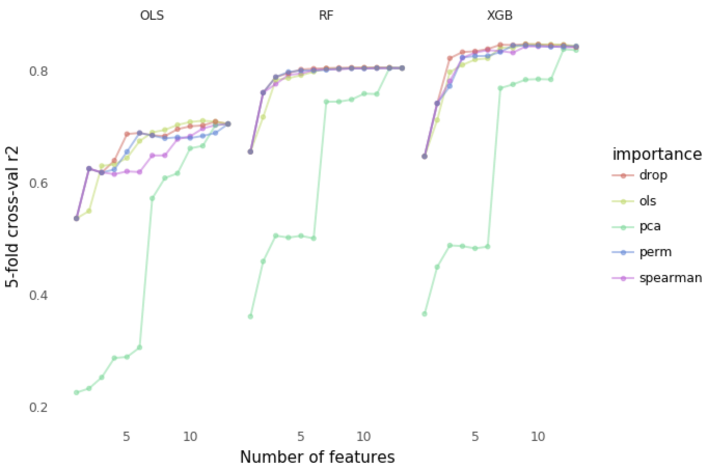

# feature-importance
A deep dive into measuring feature importance in machine learning.

In machine learning, we often want to know 1) which features are most predictive of a target, and 2) which features contribute most to a given prediction. The former is crucial to knowing which features we can afford to ignore when fitting a model, and the latter is important from a business perspective and model interpretability. Both can be obtained by analyzing the **feature importance** of a dataset.

How do we quantify feature importance? One simple method is to look at how correlated a feature is with the target. We could also perform PCA to see how influential a feature is in terms of its contribution to the variance of a principal component. More importantly, we could look at how an altered form of that feature -- either by dropping it altogether or by scrambling its observations -- affects the outcome of a model. A model that performs worse (in terms of predictive ability) with the altered feature likely means that feature is important to some degree. In other words, having that particular feature in our dataset contributes significantly to how well a model trained with that feature is able to predict the target.

This [notebook](https://github.com/ajcheon/feature-importance/blob/master/featimp.ipynb) explores several feature importance methods and how we could use feature importance to better understand datasets.
